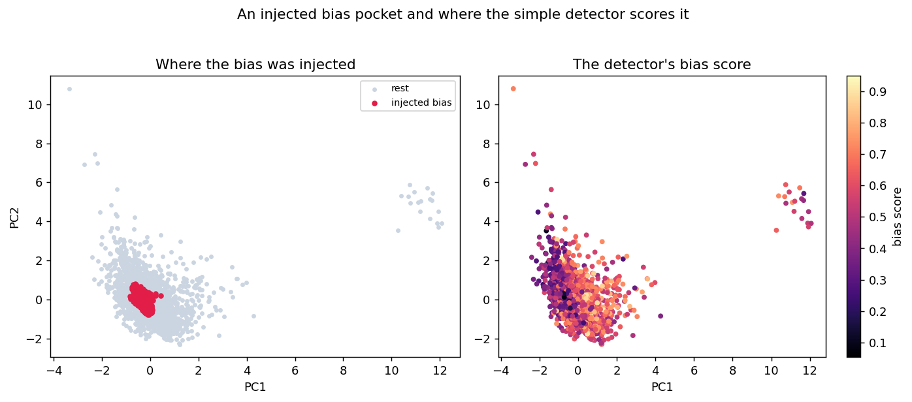

# Unbiased by Nature

Can an idea borrowed from the immune system find the bias that standard fairness tools
average away? 

This started as an undergrad research idea: the immune system is very good at noticing
local threats, so could an immune-inspired algorithm notice local *unfairness*? 

## what the Dendritic Cell Algorithm is, and why I picked it

In your immune system, dendritic cells don't classify threats from a single cue. They
roam the tissue collecting several signals at once, danger signals from damaged cells,
safe signals from healthy ones, molecular danger patterns, and integrate them over a
local context before deciding whether what they found is dangerous. The **Dendritic
Cell Algorithm** (Greensmith and Aickelin, 2008) turns that into an anomaly detector.

That mechanism is a surprisingly good *fit* for a real problem in fairness. Most
fairness tools work at the global level: they tell you a model is unfair on average.
But a model can look fine overall while badly mistreating a small, local pocket of
people, often an intersection like older applicants with a short credit history. Those
pockets are exactly the kind of *local, multi-signal* anomaly the immune system is built
to catch. So the hypothesis was reasonable: maybe an immune-inspired detector finds
local bias that global metrics miss.

## what I built

- a **Dendritic Cell Algorithm from scratch**, adapted for tabular data. The textbook
  version assumes a time series and degenerates on a static table, so it samples local
  feature-space neighbourhoods instead. That adaptation is itself the local-pocket idea.
- a **multi-signal fairness mapping** (this is where DCA should shine). Four local danger
  signals, the cross-group treatment gap, neighbourhood demographic disparity, the local
  true-positive-rate gap, and deviation from a fair reference model, plus a
  counterfactual-flip PAMP that fires when a prediction depends on the protected attribute.
- a **ground-truth benchmark**: inject a known bias into a known region, then measure how
  well each detector recovers it. 
- a comparison across **four datasets** (Adult, COMPAS, Taiwan credit, German credit),
  **two pocket geometries** (axis-aligned boxes and non-axis-aligned balls), **two noise
  regimes**, and **four detectors** including Slice Finder, a purpose-built subgroup auditor.
- **bias-relevant dimensionality weighting** so the neighbourhoods follow the bias instead
  of being washed out by irrelevant features.



## results

Inject a bias pocket, train a model on it, and ask each detector to point at where the
bias is. Higher AUC means it found the injected region.

| regime | pocket | DCA | fused (simple) | raw gap | isolation forest | Slice Finder |
|--------|--------|----:|---------------:|--------:|-----------------:|-------------:|
| clean  | axis   | 0.58 | 0.71 | 0.69 | 0.69 | 0.70 |
| clean  | ball   | 0.56 | 0.73 | 0.71 | 0.59 | 0.76 |
| weak   | axis   | 0.53 | 0.58 | 0.59 | 0.57 | 0.60 |
| weak   | ball   | 0.53 | 0.60 | 0.56 | 0.54 | 0.67 |

Two things stand out:

**A simple multi-signal local fairness score is a strong bias localizer.** The "fused"
detector, just the four local signals averaged together, recovers injected bias about as
well as Slice Finder, a specialized subgroup auditor, while being far simpler and fully
interpretable. That is a genuinely useful method to have.

**The immune machinery did not improve on it, and the experiment says exactly why.** DCA's
maturation step collapses a graded danger signal into a binary "mature or not" context and
pools it across a neighbourhood. That throws away the resolution a plain average keeps. I
built a noisy regime specifically because that is where aggregation is supposed to help,
and it still did not. So the value lives in the *signals*, a local and individual notion of
unfairness, not in the immune algorithm layered on top.

## what I learned

- The interesting question was never "does my algorithm win." It was "what actually finds
  local bias, and how do I test that honestly." Building the ground-truth benchmark mattered
  more than the algorithm.
- Aggregation is not free. A method that pools and thresholds can *lose* to one that keeps
  the raw graded signal, which is easy to forget when an idea sounds elegant.
- A clean negative result, with a mechanism, is more useful than a vague positive one. I now
  trust this conclusion because I know *why* it holds.

## run it

```bash
pip install -e .
python scripts/run_experiment.py     # reproduces the benchmark (downloads the datasets)
python scripts/make_figures.py       # regenerates the figures
```

Everything is tested and runs in CI. Each detector, signal, and dataset is a small,
documented module under `src/unbiased/`. The full numbers are in
[docs/experiment_results.csv](docs/experiment_results.csv) and the build log, including the
dead ends, is in [docs/rebuild-notes.md](docs/rebuild-notes.md).

## datasets

Adult (income, protected attribute sex), COMPAS (recidivism, race), Taiwan default of
credit card clients (default, sex), and German credit (credit risk, age). Standard fairness
preprocessing, fetched and cached on first run.

## what's next

DCA was the first algorithm I reached for, not the last word. This is really a testbed for
finding local bias, and the immune system has more than one good idea. A few directions I
want to run through the same ground-truth benchmark:

- **Negative selection, the better-fit immune algorithm.** The immune system also works by
  learning what "self" (healthy, normal) looks like and generating detectors that fire on
  anything unlike it. Map "self" to fair behaviour and those detectors cover the unfair
  regions. The real-valued version covers space with variable-radius spheres, which fit
  non-axis-aligned bias pockets far more naturally than axis-aligned slices, and it returns
  the pockets themselves rather than a score. No lossy maturation step. I think this is the
  approach that actually suits the problem, and it keeps the project honest to its name.
- **Evolutionary subgroup search.** Evolve subgroups toward maximum group disparity with a
  genetic algorithm, an evolutionary cousin of Slice Finder that is not stuck with
  axis-aligned boxes.
- **A real method from the positive result.** The simple fused signal works. Replace DCA's
  pooling with proper spatial smoothing and turn it into a clean, interpretable detector.
- **A harder benchmark.** Intersectional and multi-attribute bias, measurement and sampling
  bias rather than only label flips, and real disparities, not just injected ones.

If none of the bio-inspired bets beat the simple detector, that is a finding too, and the
benchmark is what lets me say so.
